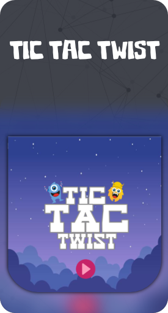
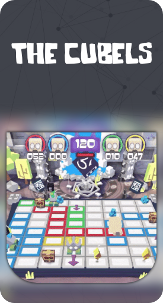
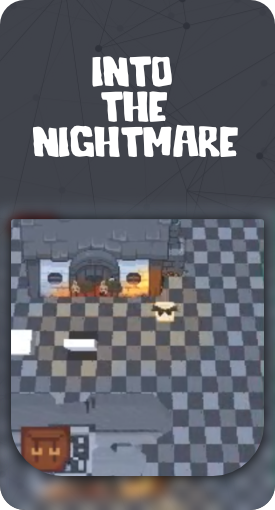
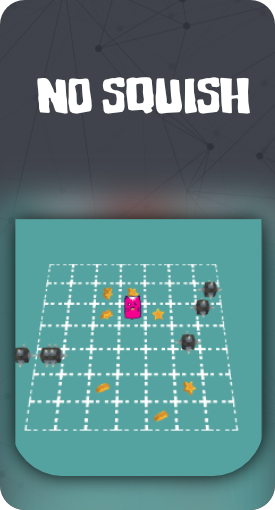
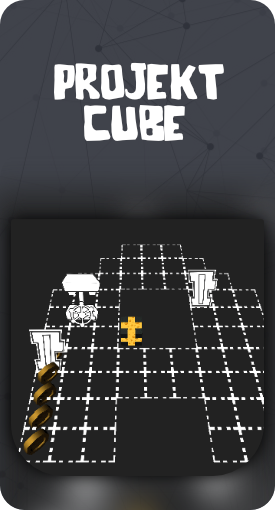
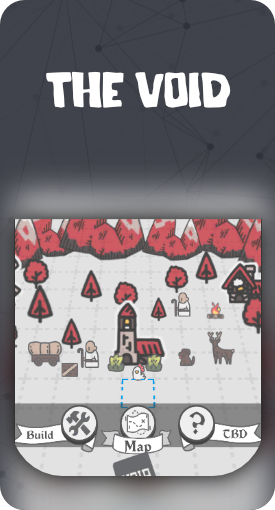
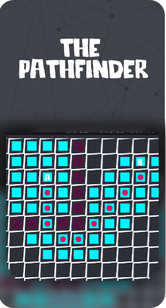
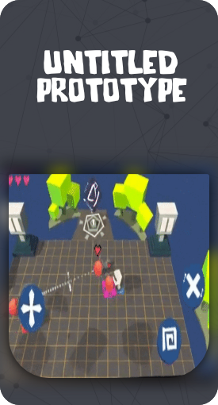
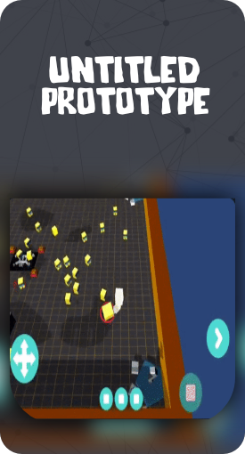

<!-- Banner -->

 

 
 
 

 

<!-- Intro -->
# Hi, there! 👋 
  I do what I love and love what I do ;)

Interests:
- Game Dev
- Apps
- Embedded Systems
- Computer Graphics
- AR/VR
 
 
 
 
<!-- About Me -->
##  About Me
 - 🎓 Bachelor in Computer Science
 - 🕹️ Indie game developer
 - 🎮 I play video games casually & competitively
 - ☕ Love for Coffee!
 - 🛹 Enjoy skateboarding
 - 📚 Bilingual
 - 📫 How to reach me: rakan.alsagoor@gmail.com
 
 
 
 
<!-- Technologies & Tools -->
## Technologies & Tools 

  
  
  
  
  
  
  
  
  
  
 
 
 
 
 

<!-- Currently -->
##  Currently
- SWE @Microsoft
- Exploring other project ideas

<!-- Projects -->
## Projects
 - Click on a project card to know more about it!
 

  
  
  
  
   
   
  
  
  
  
  
 

<!--
**rakansu/rakansu** is a ✨ _special_ ✨ repository because its `README.md` (this file) appears on your GitHub profile.

Here are some ideas to get you started:

- 🔭 I’m currently working on ...
- 🌱 I’m currently learning ...
- 👯 I’m looking to collaborate on ...
- 🤔 I’m looking for help with ...
- 💬 Ask me about ...
- 📫 How to reach me: ...
- 😄 Pronouns: ...
- ⚡ Fun fact: ...
-->
