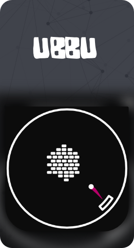
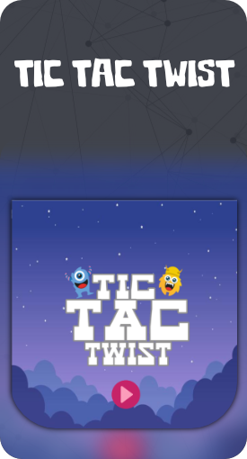
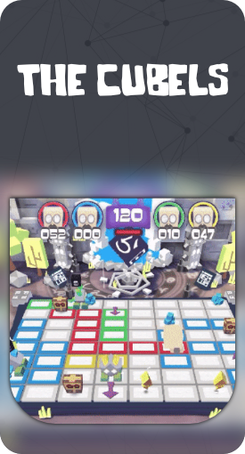
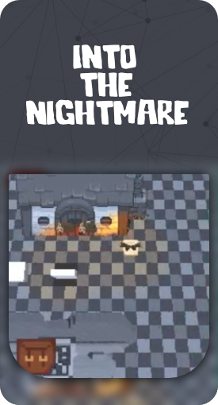
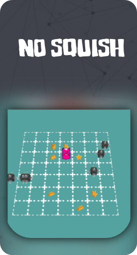
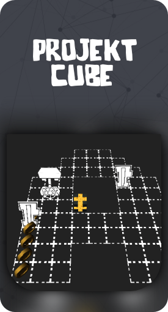
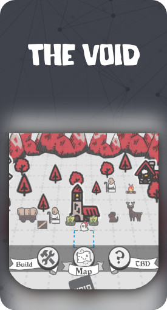
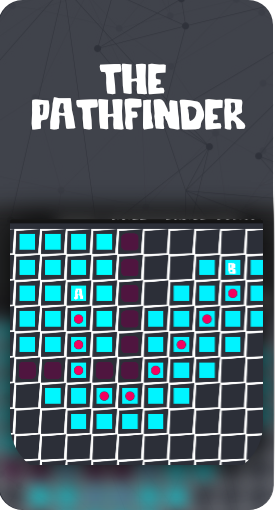
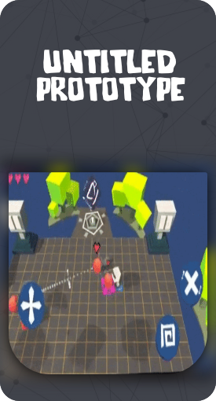
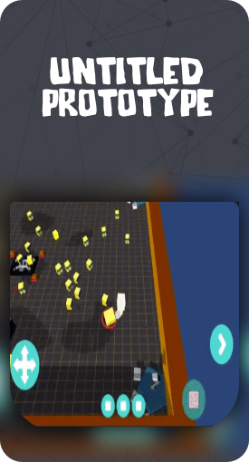

<!-- Banner -->

 

 <!--  -->
 
 

 

<!-- Intro -->
# Hi, there! 👋 

I do what I love and love what I do ;)

Impossible is a matter of resolve and time!

Interests: 
- Game Development
- Real-Time Graphics & Simulation
- AR/VR & Mixed Reality Experiences
- Cross-Platform Mobile Applications
- Embedded Systems
  

 
<!-- About Me -->
##  About Me
 - 🎓 Bachelor in Computer Science
 - 💻 Software Engineer | Game Developer
 - 🎮 I play video games casually & competitively
 - ☕ Love Coffee!
 - 📫 How to reach me:
   - <a href="https://linkedin.com/in/rakgnarr">LinkedIn
 
 
 

<!-- Projects -->
## Projects
 - Click on a project card to know more about it!
 

  
  
  
  
   
   
  
  
  
  
  
 

<!--
**rakansu/rakansu** is a ✨ _special_ ✨ repository because its `README.md` (this file) appears on your GitHub profile.

Here are some ideas to get you started:

- 🔭 I’m currently working on ...
- 🌱 I’m currently learning ...
- 👯 I’m looking to collaborate on ...
- 🤔 I’m looking for help with ...
- 💬 Ask me about ...
- 📫 How to reach me: ...
- 😄 Pronouns: ...
- ⚡ Fun fact: ...
-->
